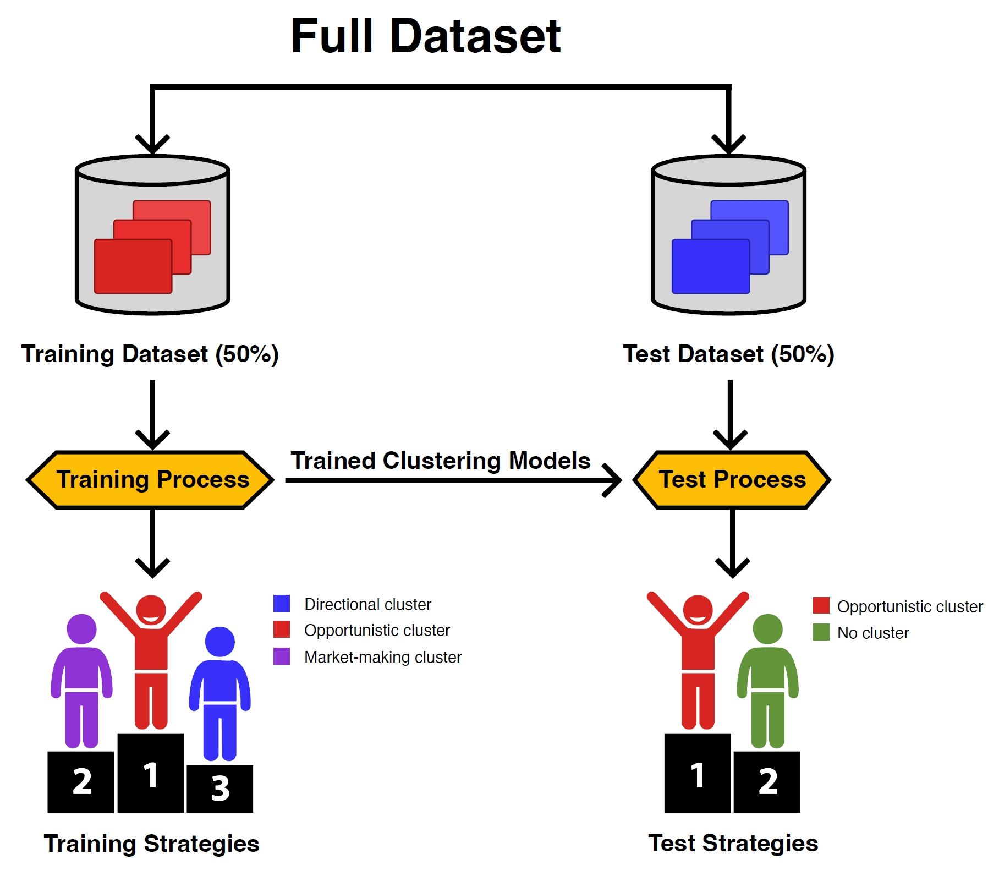
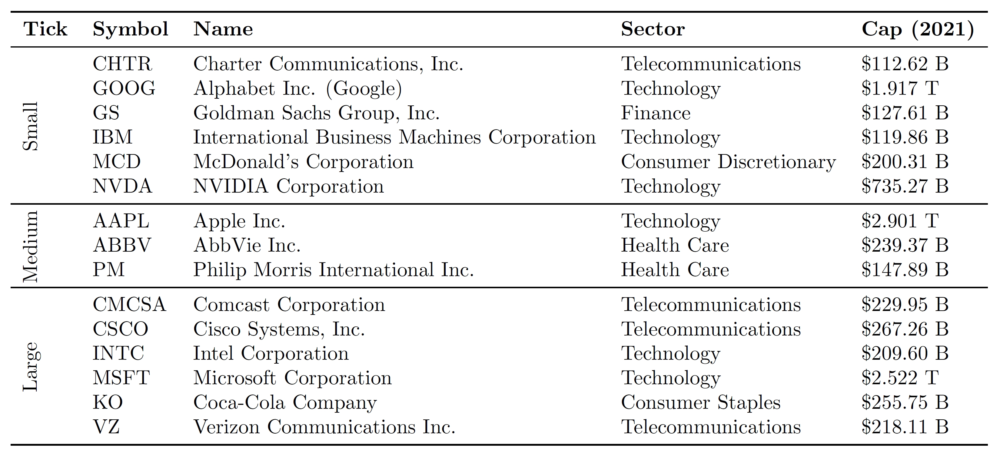
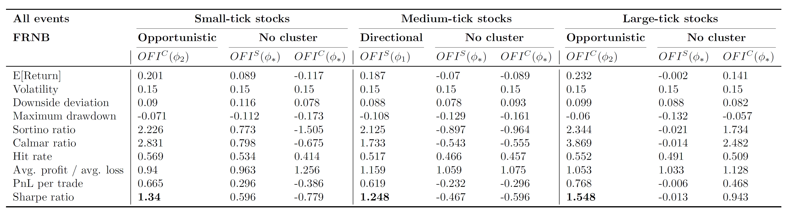
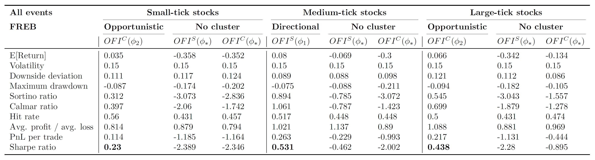

# ClusterLOB

We introduce **ClusterLOB**, a methodology designed to enhance trading performance by leveraging clustering techniques. Specifically, we classify market participants into three distinct clusters representing directional, opportunistic, and market-making traders, which allows for a more nuanced approach to market microstructure modelling and signal generation.

**Paper: [ClusterLOB: Enhancing Trading Strategies by Clustering Orders in Limit Order Books
](https://arxiv.org/abs/2504.20349).**

<div align="center">
  
</div>

## Data

We gather our data through [LOBSTER](https://lobsterdata.com/) by Huang et al. (2011), which uses ITCH data from NASDAQ to reproduce the LOB for any stock on NASDAQ to any specified level.

Table 1: Summary of 15 stocks categorized by tick size along with their sector and market capitalization.

<div align="center">
  
</div>

## Empirical Results

Table 2 and 3 report the performance metrics for *FRNB* and *FREB* across all events, separated by small-tick, medium-tick, and large-tick stocks in the test dataset. For each tick-size group, we compare OFIs derived from **ClusterLOB** against benchmark models without clustering. Empirical results demonstrate that signals derived from clusters consistently outperform benchmark models without clustering in all event types, especially in terms of SR and other risk-adjusted metrics. 

Table 2: Performance metric results for *FRNB* across all events for small-tick, medium-tick, and large-tick stocks in the test dataset. The highest SR within each tick-size group is highlighted.

<div align="center">
  
</div>

Table 3: Performance metric results for *FREB* across all events for small-tick, medium-tick, and large-tick stocks in the test dataset. The highest SR within each tick-size group is highlighted.

<div align="center">
  
</div>

We further assess the robustness of **ClusterLOB** by decomposing performance across different event types (add, cancel, and trade), confirming that the **ClusterLOB** remains effective across a wide range of market conditions. More detailed discussion can be found in the [paper](https://arxiv.org/abs/2504.20349).

## Citation
If you find this repository helpful in your work, please cite our paper.
```bibTex
@misc{zhang2025clusterlobenhancingtradingstrategies,
      title={ClusterLOB: Enhancing Trading Strategies by Clustering Orders in Limit Order Books}, 
      author={Yichi Zhang and Mihai Cucuringu and Alexander Y. Shestopaloff and Stefan Zohren},
      year={2025},
      eprint={2504.20349},
      archivePrefix={arXiv},
      primaryClass={q-fin.TR},
      url={https://arxiv.org/abs/2504.20349}, 
}
```
